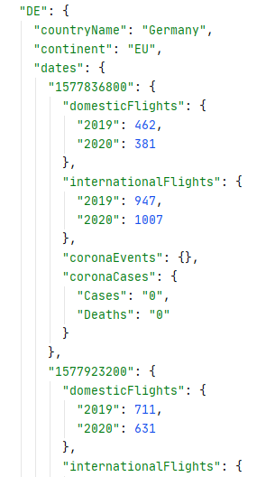

Dokumentation des Projektes _Corona Flugverkehr_ zum Thema _Social Distancing_, das im Rahmen
des Kurses _Grundlagen der Datenvisualisierung_ bei Herrn Prof. Dr. Till Nagel im
Sommersemester 2020 an der Hochschule Mannheim stattgefunden hat.

Die Corona Pandemie hat durch die Corona-Verordnungen zum Social Distancing und weiteren Einschränkungen geführt.
Im Projekt _Corona Flugverkehr_ wird untersucht, welche Auswirkungen die Corona-Einschränkungen auf den weltweiten
Flugverkehr haben und wie diese im Verhältnis der positiv auf Corona getestet Personen stehen.
Die Daten des Flugverkehrs waren im Rahmen der Forschung frei zugänglich; die Zahlen der positiv auf Corona
getesteten Personen werden vom Offenen Datenportal der EU bereitgestellt. Es konnte festgestellt
werden, dass die Zahlen der positiv getesteten Personen im Zusammenhang mit dem Einbruch des globalen Flugverkehrs stehen.

# Einführung und Konzept

## Einführung

Dieses Projekt ist im Rahmen der Vorlesung _Grundlagen der Datenvisualisierung_ entstanden. Die Vorgabe war Daten
die im Kontext von Social Distancing stehen, auszuwählen, aufzubereiten, sie zu analysieren und schließlich mit einer
interaktiven Visualisierung darzustellen.
Nach einer gemeinsamen Recherche, sind wir auf den Flugverkehr gekommen, der durch die Reisebeschränkungen starke
Veränderungen aufweist. Deshalb haben wir uns den Verlauf des Flugverkehrs genauer angesehen.

## Konzept

Zu Beginn planten wir ein interaktives Dashboard, das wir auf einer Website bereitstellen. Nach einer Recherche über
mögliche Visualisierungen entschieden wir uns für eine radiale Heatmap, die den Flugverkehr ausgewählter Länder im 
Vergleich zum Vorjahr darstellen soll. Des Weiteren zwei Liniendiagramme, die den Flugverkehr und die Corona Fälle 
für ein, durch den Nutzer in der Heatmap auswählbares, Land über den zeitlichen Verlauf darstellen sollen.  
Diese Visualisierungen sollte dabei folgende Fragen beantworten:

##### _Wie haben sich die Einschränkungen des SARS-CoV-2-Virus auf den weltweiten Flugverkehr ausgewirkt?_
##### _Welche Änderungen der einzelnen Länder gab es im Vergleich zum Vorjahr?_
##### _Welche Länder waren besonders schwer betroffen?_
##### _Wie wirkten sich die Coronamaßnahmen auf den Flugverkehr aus?_
 
Für die Umsetzung des Dashboards entschieden wir uns für _D3.js_, eine JavaScript Bibliothek zum Erstellen von Visualisierungen. Darüber
hinaus entschieden wir uns für das Front-End Framework _Vue.js_.

# Datenauswertung und Aufbereitung

## Daten

Unsere Datenquellen waren die Flugdaten des [OpenSky Networks](https://opensky-network.org) und die Coronadaten des 
offenen [Datenportals der EU](https://data.europa.eu/euodp/de/data/dataset/covid-19-coronavirus-data).
Das OpenSky Network ist ein gemeinnütziger Verein mit Sitz in der Schweiz, der Flugdaten aufzeichnet. Die Flugdaten 
werden durch eine Vielzahl an Sensoren aufgezeichnet, die weltweit verstreut sind. Die meisten dieser Sensoren befinden 
sich in Europa und den USA. Sie stellten aufgrund des Hohen Interesses — ausgelöst durch die Pandemie — einen bereinigten 
Datensatz öffentlich zur Verfügung. Dieser Datensatz enthielt allerdings nicht den Start und das Ziel der Flugzeuge.
Deshalb kontaktierten wir die Zuständigen und baten um den vollständigen Datensatz. Schnell wurde uns der Zugriff auf die 
Datenbank des Netzwerks gewährt, wodurch wir alle vom Netzwerk gesammelten Daten erhalten haben.  
Das offene Datenportal der EU stellt die weltweiten Fälle der Corona Infektionen bereit.

## Auswertung

Der Flugdatensatz des OpenSky Networks umfasst über 20 Billionen Einträge, durch die wir uns erst ein Mal durcharbeiten 
mussten. Schnell konnte man sehen, wie stark die Flugzahlen in den letzten Wochen und Monaten abgenommen haben. Auf 
unseren Visualisierungen konnte man klar erkennen, dass die Flugzahlen zeitgleich mit dem Anstieg der Coronafälle stark 
gefallen sind. Zusätzlich haben wir die Flugdaten von diesem Jahr mit den Flugdaten vom letzten Jahr verglichen, damit wir
sicherstellen können, dass die Einbrüche der Flugzahlen mit dem Anstieg der Coronafälle zusammen hängen.  
Folgende Abbildung zeigt die Datenexploration über dein Einbruch des Flugverkehrs
 
 

## Prozess

Da wir auf unserer Website aus Gründen der Performanz nur eine Datei laden wollten, haben wir uns dazu entschieden, die Daten 
in einer JSON-Datei zu speichern. Dieses Dateiformat wird nativ in JavaScript (also im Browser) unterstützt und lässt sich 
somit ohne zusätzliches Parsen einlesen. Da der Umfang der Flugdaten enorm ist, mussten wir die für unser Projekt relevanten 
Daten aus den Rohdaten ziehen und in eine für uns verwertbare Form bringen. Dafür haben wir die Flugnummer, den Abflug- und 
Zielflughafen sowie den Tag des Fluges aus den Flugdaten gezogen. Anschließend haben wir mit Hilfe der Flughäfen eines Fluges 
das Ursprungsland bzw. Ankunftsland ermittelt. Nach diesem Schritt besteht ein Eintrag der Flugdaten aus einem Tag, dem Ursprungsland 
und dem Ankunftsland eines Fluges. Im Anschluss müssen die Flüge für ein Land an einem Tag gezählt werden und in Innlands- oder 
Internationale-Flüge aufgeteilt werden. Ein Flug der im gleichen Land startet und landet wird dabei als Innlandsflug betrachtet, 
jeder andere als international. Die am Ende entstandene JSON-Datei beinhaltet letztendlich einen Eintrag für jedes Land sowie die 
dazugehörige Fluganzahl an den verschiedenen Tagen des Jahres. Dabei wird für jeden Tag die Fluganzahl im Jahr 2019 und im 
Jahr 2020 gespeichert, damit die beiden Werte später leicht verglichen werden können.
 
 
 

# Entwicklung

## Entstehung des Prototypen

**Heat Map**  
Um zu entscheiden, welche Visualisierung sich für unsere Flugdaten eigneten ließen wir uns von 
[Data Viz Project](https://datavizproject.com/) inspirieren. 
Dabei sind wir auf eine [radiale Heat Map](https://datavizproject.com/data-type/radial-heatmap/) gestoßen.  
 
  
 
Da es sich bei Ländern und Monaten um ordinale Merkmale und bei der Anzahl der Flieger um ein quantitatives Merkmal handelt, 
bot sich eine Heat Map an. Zusätzlich inspirierten uns die Punkte in den einzelnen Feldern, um Corona Events, wie beispielsweise 
die Schließung der amerikanischen Grenzen, anzeigen zu lassen. Diese Corona Events sollten den Zusammenhang zwischen dem 
Einbruch des Flugverkehrs und dem Inkrafttreten von Kontaktbeschränkungen untersuchen. Des Weiteren eignet
sich eine radiale Heat Map gut um einzelne Länder und Monate miteinander zu vergleichen.  
Die folgende Abbildung zeigt unsere erste Version eines datengestützten Prototypen.  
 
  
 
Nach dem ersten datengestützten Prototypen bemerkten wir, dass keine sinnvolle Reihenfolge für die Anordnung der Ländern 
gewählt werden konnte. Darüber hinaus entspricht ein zeitlicher Verlauf von rechts nach links — wie es in der gesamten linken 
Hälfte der radialen Heatmap passiert — nicht der Erwartung von zeitlichen Verläufen. Deshalb entschieden wir uns eine lineare Heatmap 
für die Visualisierung der Flugdaten zu wählen. 
 
Die Farbskala der Heat Map war zu Beginn fließend. Dies änderten wir in eine Farbskala mit 7 Bereichen. Nuancen lassen sich zwar 
nicht mehr erkennen, aber durch den gleichen Farbton lassen sich Gemeinsamkeiten beim Vergleich mehrerer Länder besser erkennen.  
 
**Liniendiagramm der Flugdaten**  
In einem Liniendiagramm wollten wir ermöglichen den Flugverkehr eines bestimmten Landes sowohl mit dem inländischen als 
auch mit dem weltweiten Flugverkehr zu vergleichen. Um einen zeitlichen Verlauf mit mehreren quantitativen Daten zu visualisieren 
bot sich ein Liniendiagramm an. Um starke Ausreißer an einzelnen Tagen zu vermeiden, haben wir ein gleitendes Mittel von drei Tagen 
für die Berechnung der Kurve verwendet. Dies hatte den Nachteil, dass beispielsweise ein Wochenende im Jahr 2020 mit der Mitte 
der Woche des Jahres 2019 verglichen wird, was die Ergebnisse verfälscht hätte. Deshalb entschiedenwir uns ein gleitendes 
Mittel aus sieben Tagen zu verwenden und so die Kalender Wochen der beiden Jahre miteinander zu vergleichen um den Anstieg bzw. 
Einbruch des Flugverkehrs zum Vorjahr zu berechnen. Die folgende Abbildung zeigt die erste Version der Flugdaten.
 
 
 
In der ersten Abbildung kann man im fertigen Prototypen den internationalen und weltweiten Flugverkehr ohne gleitendes Mittel. Die 
Grafik darunter zeigt die gleichen Daten mit einem gleitenden Mittel. Man kann erkennen,dass durch die Glättung mit dem 
gleitenden Mittel die Ausreißer verschwinden, die an Wochendenden für Schwankungen sorgen. Dadurch lassen sich Trends besser erkennen.
 
 

 
 

 
 
**Liniendiagramm der Coronadaten**  
Unter dem Liniendiagramm der Flugdaten visualisieren wir die Corona Daten ebenfalls in einem Liniendiagramm. Durch die 
äquivalente zeitliche Achse kann so im zeitlichen Verlauf der Zusammenhang zwischen dem Einbrechen des Flugverkehrs und 
dem steigen der positiven Corona Fälle beobachtet werden. Folgende Abbildung zeigt die 
erste Version unserer Visulaisierung der Coronafälle
 
 

## Prototyp

 
 
Den **Prototypen** können Sie hier **live testen**: [Corona Flugverkehr](https://sirbenedick.github.io/corona-aviation-impact/)
 
 
In unserem finalen Prototyp befindet sich die — jetzt lineare — Heat Map auf der linken Seite. Mit einem Schalter oberhalb 
der Heatmap kann man zwischen der Ansicht für inländischen und internationalen Flugverkehr wechseln. Bewegt man die Maus 
über eine Zelle, wird ein Tooltip angezeigt. Dieser erläutert, ob es im gewählten Monat einen Anstieg oder Einbruch des 
Flugverkehrs im Vergleich zum Vorjahr gegeben hat. Durch das Klicken eines Feldes in der Heat Map bekommt man eine
detaillierte Darstellung im rechten Teil des Prototypen für das ausgewählte Land.  
 
In der Visualisierung im rechten Teil des Prototypen kann der inländische und internationale Flugverkehr eines Landes mit 
dem weltweiten Flugverkehr verglichen werden.Bewegt man die Maus über das Liniendiagramm, wird sowohl der genaue Tag 
innerhalb einer Woche, als auch die konkreten Veränderungen zum Vorjahr angezeigt.  
 
Unter dem Liniendiagramm des Flugverkehrs findet sich eine Visualisierung der täglich positiv auf Covid-19 getesteten 
Personen. Durch die äquivalente Zeitachse kann der Flugverkehr mit dem Verlauf von Covid-19 verglichen werden.

## Implementierung

Für die Umsetzung der Visualisierung bevorzugten wir ein JavaScript-basiertes Tool, da wir unsere Visualisierung auf einer 
Website bereitstellen wollten. Bei der Wahl der Tools kamen also D3.js und Chart.js in die nähere Auswahl. Mit Chart.js 
lassen sich gängige Visualisierungen einfach umsetzten. Allerdings schränkt Chart.js die Freiheit bei der Umsetzung von 
Visualisierungen ein, weshalb es für unser Projekt, mit der radialen Heatmap, nicht geeignet war. Wir entschieden und also 
für D3.js. Dieses bietet den Vorteil, dass sich sowohl komplexe als auch interaktive Visualisierungen frei umsetzten lassen.  
 
Die Schwierigkeit an D3.js war die steile Lernkurve. Für die Auseinandersetzung mit D3.js wollten wir ein bestehendes Diagramm 
nehmen und es nach unseren Bedürfnissen anpassen. Dabei stellte sich heraus, dass D3.js verschiedene Versionen besitzt, 
die nicht kompatibel miteinander sind. Dadurch war das von uns herangezogene Diagramm veraltet und wir konnten nicht damit 
arbeiten. Zusätzlich hat D3.js keine einheitliche Dokumentation, was die Implementierung zusätzlich erschwerte. Deshalb 
haben wir uns mit der Syntax von D3.js im Detail auseinandergesetzt, um unsere Visualisierung zu erstellen.
 
Da wir unser Ergebnis auf einer Website bereitstellen wollten, entschieden wir uns für ein Web-Framework, dass das iterative 
Umsetzen eines Prototypen erleichtert. Hier fiel unsere Entscheidung auf das ebenfalls JavaScript basierte Framework Vue.js. 
Aufgrund der hohen Flexibilität ließ sich dieses gut mit D3.js kombinieren. Darüber hinaus hatten wir in unserem Team bereits 
Erfahrung mit _Element UI_, dass mit Vue.js die Gestaltung des Layouts ermöglichte.

# Erkenntnisse
### China: first to spread, first to lock down
Das Ziel unseres Prototypen war es, zu untersuchen, ob die Einschränkungen des Flugverkehrs eine Auswirkung auf die 
Ausbreitung von SARS-Cov-2 hatte. China war das erste Land, das den Flugverkehr stark eingeschränkt hat, dies lag natürlich 
daran, dass das Virus in China ausgebrochen ist. Nach den Einschränkungen des Flugverkehrs haben auch die Neuinfektionen 
stark abgenommen.
 
 

 
### USA with a late lockdown
Natürlich liegt dies nicht nur an den Einschränkungen des Flugverkehrs. Man kann hier jedoch sagen, dass diverse Vorkehrungen, 
die sich mit Social Distancing befassen, bei der Eindämmung der Pandemie geholfen haben. Dies kann man beispielsweise auch an den 
USA sehen. Bei den Diagrammen der USA kann man sehen, dass der Flugverkehr nur zum Teil eingestellt wurde. In den USA wurde 
der Lockdown anfangs nicht so ernst genommen wie beispielsweise in China. Dies könnte ein Grund dafür sein, dass die 
Neuinfektionen in den USA nur recht langsam abnehmen.
 
 

 
### Austria enjoys gliding
Während unseren Untersuchungen sind wir zudem auf die Flugzahlen von Österreich gestoßen. Die Inlandsflüge von Österreich 
haben zunächst stark abgenommen. In den letzten Wochen sind diese jedoch wieder sehr stark angestiegen. Es gibt Wochen in 
denen es teilweise doppelt so viele Inlandflüge, wie im Jahr davor gibt. Bei näherer Recherche und durch Bekannte konnten 
wir dann erfahren, dass dieser Ausschlag der Flugzahlen durch viele private Flüge mit Segelflugzeugen und kleinen Propellermaschinen 
entstanden sein könnte.
 
 

 
Weitere ausgewählte Erketnisse beschreiben wir in unserem [Prototyp](https://sirbenedick.github.io/corona-aviation-impact/) 
unterhalb der Visualisierungen.

# Fazit

Durch unseren Prototypen konnte gezeigt werden, wie sich der Verlauf des Flugverkehrs durch die
Einschränkungen des Corona Virus geändert hat. Darüber hinaus konnte die Korrelation zwischen
dem Flugverkehr und dem Verlauf der Pandemie gezeigt werden. Durch die Skripts die unsere
Daten bereinigen und bereitstellen, können wir jederzeit den Datensatz aktualisieren um auch
zukünftig den Verlauf der Pandemie und des Flugverkehrs darzustellen.

# Ausblick

Der erste Schritt, den wir beim weiteren Ausbauen unseres Dashboards gehen würden, wäre das
automatisierte Updated der Daten. Dies hätte den Vorteil, dass wir unsere Skripts nicht mehr manuell
ausführen müssen um aktuelle Daten zu bereinigen und in unser Datenformat umzuwandeln.  
 
Darüber hinaus könnte man ein _Story Telling_ entwickeln, sodass die Highlights nicht einzeln statisch
im Text sind. Diese sollen einerseits dynamisch sein, d. h. durch scrollen ändern sich diese
automatisch und es muss nur noch ein Platz für sie reserviert werden. Der Benutzer sieht also aus
seiner Sicht an der exakten Stelle unterschiedliche Visualisierungen, die die Highlights darstellen.
Andererseits sollten diese Visualisierungen auch interaktiv sein, dass der Nutzer die Möglichkeit
hat die Daten zu explorieren.
