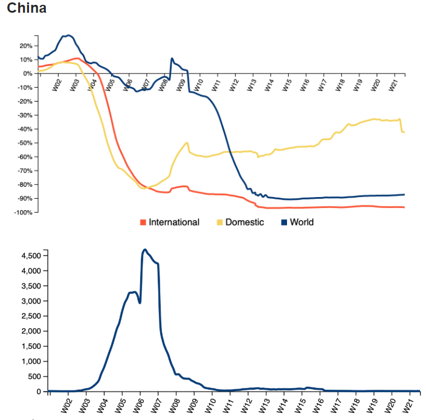

Alexander Köhler, Benedict Kruse, Nico Gensheimer, Luca Gauß, Dominik Klar
# Corona Flugverkehr
Dokumentation des Projektes 'Corona Flugverkehr' zum Thema ‘Social Distancing’, das im Rahmen
des Kurses 'Grundlagen der Datenvisualisierung' bei Herrn Prof. Dr. Till Nagel im 
Sommersemester 2020 an der Hochschule Mannheim stattgefunden hat.

Die Corona Pandemie hat durch die Corona-Verordnung zum Social Distancing und weiteren Einschränkungen geführt.
Im Projekt *Corona Flugverkehr* wird untersucht, welche Auswirkungen die Corona-Einschränkungen auf den weltweiten
Flugverkehr haben und wie diese im Verhältnis der positiv auf Corona getestet Personen stehen.
Die Daten des Flugverkehrs waren im Rahmen der Forschung frei zugänglich; die Zahlen der positiv auf Corona
getesteten Personen werden vom Offenen Datenportal der EU bereitgestellt. Es konnte festgestellt
werden, dass die Zahlen der positiv getesteten Personen im Zusammenhang mit dem Einbruch des globalen Flugverkehrs stehen.

# Einführung / Konzept
## Einführung
Dieses Projekt ist im Rahmen der Vorlesung 'Grundlagen der Datenvisualisierung' entstanden. Die Vorgabe war Daten 
die im Kontext von Social Distancing stehen auszuwählen, aufzubereiten, sie zu analysieren und schließlich mit einer 
interaktiven Visualisierung sichtbar zu machen.
Nach einer gemeinsamen Recherche, sind wir auf den Flugverkehr gekommen, der durch die Reisebeschränkungen stark
betroffen ist. Deshalb haben wir uns den Verlauf des Flugverkehrs genauer angesehen.

## Konzept
Zu Beginn planten wir ein interaktives Dashboard, das wir auf einer Website bereitstellen. Nach einer Recherche über
mögliche Visualisierungen entschieden wir uns für eine radiale Heatmap, die den Flugverkehr im Vergleich zum Vorjahr
darstellen soll. Des Weiteren zwei Liniendiagramme, die den Flugverkehr und die Corona Fälle im Detail über den zeitlichen Verlauf
darstellen sollen. \
Diese Visualisierung sollte dabei folgende Frage beantworten:

######*Wie haben sich die Einschränkungen des SARS-CoV-2-Virus auf den weltweiten Flugverkehr ausgewirkt?*

Für die Umsetzung des Dashboards entschieden wir uns für *D3*, eine JavaScript Library zum Erstellen von Visualisierungen. Darüber 
hinaus entschieden wir uns für das Front-End Framework *Vue*.

# Daten / Auswertung / Prozess

## Daten
Unsere Datenquellen waren die Flugdaten des OpenSky Networks und die Coronadaten des offenen Datenportals der EU.
Das OpenSky Network ist ein Unternehmen in der Schweiz, die Flugdaten aufzeichnen. Die Flugdaten werden durch ca. 1000 Sensoren aufgezeichnet, die weltweit verstreut sind. Die meisten dieser 1000 Sensoren befinden sich in Europa und den USA.
Sie stellten aufgrund des Hohen Interesses — ausgelöst durch die Pandemie — einen bereinigten Datensatz öffentlich zur Verfügung. Dieser Datensatz enthielt allerdings nicht den Start und das Ziel der Flugzeuge.
Deshalb kontaktierten wir sie und baten um den vollständigen Datensatz, der uns durch den Rahmen eines Hochschulprojektes bereitgestellt wurde. \
Das offene Datenportal der EU stellt die weltweiten Fälle der Corona Infektionen bereit. 

## Auswertung
Die Flugdaten des OpenSky Networks fasst über 20 Billionen Datensätze, durch die wir uns erst ein Mal durcharbeiten mussten. Schnell konnte man sehen, wie stark die 
Flugzahlen in den letzten Wochen und Monaten abgenommen haben. Auf unseren Visualisierungen konnte man klar erkennen, dass die Flugzahlen zeitgleich mit dem Anstieg 
der Coronafälle stark gefallen sind. Zusätzlich haben wir die Flugdaten von diesem Jahr mit den Flugdaten vom letzten Jahr vergleichen, damit wir 
sicherstellen können, dass die Einbrüche der Flugzahlen mit dem Anstieg der Coronafälle zusammen hängen.

## Prozess
Damit wir auf unserer Website aus Gründen der Performanz nur eine Datei laden wollten, haben wir uns dazu entschieden, die Daten in ein JSON zu exportieren. 
Da jedoch viele Daten für uns unbrauchbar waren, mussten wir zunächst die Datensätze bereinigen und haben 
danach die für uns relevanten Daten, sowohl die des Flugverkehrs, als auch der Corona Daten in ein JSON importiert. \
\
  

# Prototyp / Ergebnisse
## Entstehung des Prototypen
__Heat Map__ \
Um zu entscheiden, welche Visualisierung sich für unsere Flugdaten eigneten ließen wir uns von <a href="https://datavizproject.com/" target="_blank">datavisprojects</a> inspirieren. Dabei
sind wir auf eine radiale Heat Map gestoßen. \
\
 \
\
Da es sich bei Ländern und Monaten um nominale Merkmale und bei der Anzahl der Flieger um ein quantitatives Merkmal handelt, bot sich eine Heat Map an. Zusätzlich 
inspirierten uns die Punkte in den einzelnen Feldern bestimmt Corona Events, wie beispielsweise die Schließung der amerikanischen Grenzen, anzeigen zu lassen. Diese
Corona Events sollten den Zusammenhang zwischen dem Einbruch des Flugverkehrs und dem Inkrafttreten von Kontaktbeschränkungen untersuchen. Des Weiteren eignet 
sich eine radiale Heat Map gut um einzelne Länder und Monate miteinander zu vergleichen. \
Abb. XY zeigt unsere erste Version eines datengestützten Prototypen. \
\
 \
\
Nach dem ersten datengestützten Prototypen bemerkten wir, dass keine sinnvolle Reihenfolge gewählt werden konnte, nach der die Länder sortiert werden. Darüber hinaus 
entspricht ein zeitlicher Verlauf von rechts nach link — wie es im gesamten linken Teil der Visualisierung passiert — nicht der Erwartung von zeitlichen Verläufen. \
Deshalb entschieden wir uns eine lineare Heat Map für die Visualisierung der Flugdaten zu wählen. \
Die Farbskala der Heat Map war zu Beginn fließend. Dies änderten wir in eine Farbskala mit 7 Bereichen. Nuancen lassen sich zwar nicht mehr erkennen, aber durch
den gleichen Farbton lassen sich Gemeinsamkeiten beim Vergleich mehrerer Länder besser erkennen. \
\
 \
\
__Liniendiagramm der Flugdaten__ \
In einem Liniendiagramm wollten wir ermöglichen den Flugverkehr eines bestimmten Landes sowohl mit dem inländischen als auch mit dem weltweiten Flugverkehr zu vergleichen. Um einen 
zeitlichen Verlauf mit mehreren quantitativen Daten zu visualisieren bot sich ein Liniendiagramm an. Um starke Ausreißer an einzelnen Tagen zu vermeiden, haben wir ein gleitendes Mittel von drei Tagen für die Berechnung der Kurve verwendet. Dies hatte
den Nachteil, dass beispielsweise ein Wochenende im Jahr 2020 mit der Mitte der Woche des Jahres 2019 verglichen wird, was die Ergebnisse verfälscht hätte. Deshalb entschieden
wir uns ein gleitendes Mittel aus sieben Tagen zu verwenden und so die Kalender Wochen der beine Jahre miteinander zu vergleichen um den Anstieg bzw. Einbruch des Flugverkehrs
zum Vorjahr zu berechnen.

__Liniendiagramm der Corona Daten__ \
Unter dem Liniendiagramm der Flugdaten visualisierten wir die Corona Daten ebenfalls in einem Liniendiagramm. Durch die äquivalente zeitliche Achse kann so im zeitlichen Verlauf
der Zusammenhang zwischen dem Einbrechen des Flugverkehrs und dem steigen der positiven Corona Fälle beobachtet werden.

## Prototyp
 
\
\
Den __Prototypen__ können Sie hier __live testen__: <a href="https://sirbenedick.github.io/corona-aviation-impact/">Corona Flugverkehr</a>
\
\
In unserem finalen Prototyp befindet sich die — jetzt lineare — Heat Map auf der linken Seite. Auf einem Schalter oberhalb der Heat Map kann man ein Wechsel der Ansicht
zwischen dem inländischen und internationalen Flugverkehr anstoßen. Hält man über ein Feld, wird ein beschreibender Text angezeigt. Dieser erläutert, ob es 
im gewählten Monat einen Anstieg oder Einbruch des Flugverkehrs, verglichen mit dem Vorjahr, gegeben hat. Durch das Auswählen eines Feldes in der Heat Map bekommt man eine 
detaillierte Darstellung im rechten Teil des Prototypen für dieses Land. \
\
In der Visualisierung im rechten Teil des Prototypen kann der inländische und internationale Flugverkehr eines Landes mit dem weltweiten Flugverkehr verglichen werden.
Hält man über das Liniendiagramm, wird sowohl der genaue Tag innerhalb einer Woche angezeigt, als auch die konkreten Veränderungen zum Vorjahr angezeigt. \
\
Unter dem Liniendiagramm des Flugverkehrs findet sich eine Visualisierung der positiv auf Covid-19 getesteten Personen. Durch die äquivalente Zeitachse kann der Flugverkehr
mit dem Verlauf von Covid-19 verglichen werden.

## Implementierung
Für die Umsetzung der Visualisierung bevorzugten wir ein JavaScript-basiertes Tool, da wir unsere Visualisierung auf einer Website bereitstellen wollten. 
Bei der Wahl der Tools kamen also D3.js und Chart.js in die nähere Auswahl. Mit Chart.js lassen sich einfache Visualisierungen einfach umsetzten. Allerdings bietet
Chart.js keine Interaktion, weshalb es für unser Projekt nicht geeignet war. Wir entschieden und also für D3.js. Dieses bietet den Vorteil, dass sich wohl komplexe
als auch interaktive Visualisierungen umsetzten lassen. \
\
Die Schwierigkeit an D3.js war die steile Lernkurve. Für die Auseinandersetzung mit D3.js wollten wir ein bestehendes Diagramm nehmen und es nach unseren Bedürfnissen anpassen.
Dabei stellte sich heraus, dass d3.js einige Versionen hat, was dies verhinderte. Zusätzlich hat D3.js keine einheitliche Dokumentation, was die Implementierung zusätzlich
erschwerte. Deshalb haben wir uns mit der Syntax von D3.js im Detail auseinandergesetzt, um unsere Visualisierung zu erstellen. \
\
Da wir unser Ergebnis auf einer Website bereitstellen wollten, entschieden wir uns für ein Web-Framework, dass das iterative Umsetzen eines Prototypen erleichtert.
Hier fiel unsere Entscheidung auf das ebenfalls auf JavaScript basierte Framework Vue.js. Aufgrund der hohen Flexibilität ließ sich diese gut mit D3.js kombinieren. 
Darüber hinaus hatten wir in unserem Team bereits Erfahrung mit _Element UI_, dass mit Vue.js die Gestaltung des Layouts ermöglichte.

# Erkenntnisse

Das Ziel unseres Prototypen war es, zu untersuchen, ob die Einschränkungen des Flugverkehrs eine positive Auswirkung auf die Ausbreitung von SARS-Cov-2 hatte. China war das erste Land, das den Flugverkehr stark eingeschränkt hat, dies lag natürlich daran, da in China das Virus ausgebrochen ist. Nach den Einschränkungen des Flugverkehrs haben auch die Neuinfektionen stark abgenommen.\
\

\
\
Natürlich liegt dies nicht nur an den Einschränkungen des Flugverkehrs. Man kann hier jedoch sagen, dass diverse Vorkehrungen, die sich mit Social Distancing befassen, bei der Eindämmung der Pandemie geholfen haben. Dies kann man beispielsweise auch an den USA sehen. Bei den Diagrammen der USA kann man sehen, dass der Flugverkehr nur zum Teil eingestellt wurde.
In den USA wird der Lockdown nicht so ernst genommen wie beispielsweise in China. Dies könnte ein Grund sein, warum die Neuinfektionen in den USA nur recht langsam abnehmen.
\
\

\
\
Während unseren Untersuchungen sind wir zudem auf die Flugzahlen von Österreich gestoßen. Die Inlandflüge von Österreich haben zunächst stark abgenommen. In den letzten Wochen jedoch sind diese wieder sehr stark angestiegen. Es gibt Wochen in denen es teilweise doppelt so viele Inlandflüge, wie im Jahr davor gibt. Bei näherer Recherche und durch Bekannte konnten wir dann erfahren, dass dieser Ausschlag der Flugzahlen durch viele Flüge mit Segelflugzeugen entstanden ist.\
\

# Fazit
Durch unseren Prototypen konnte gezeigt werden, wie sich der Verlauf des Flugverkehrs durch die
Einschränkungen des Corona Virus geändert hat. Darüber hinaus konnte die Korrelation zwischen 
dem Flugverkehr und dem Verlauf der Pandemie gezeigt werden. Durch die Skripts die unsere
Daten bereinigen und bereitstellen, können wir jederzeit den Datensatz aktualisieren um auch
zukünftig den Verlauf der Pandemie und des Flugverkehrs darzustellen.

# Ausblick
Der erste Schritt, den wir beim weiteren Ausbauen unseres Dashboards gehen würden, wäre das
automatisierte Updated der Daten. Dies hätte den Vorteil, dass wir unsere Sktipts nicht mehr manuell
ausführen müssten. \
\
Darüber hinaus könnte man eine _Story Telling_ entwickeln, sodass die Highlights nicht einzeln statisch
im Text sind. Diese sollen einerseits dynamisch sein, d. h. durch scrollen ändern sich diese
automatisch und es muss nur noch ein Platz für sie reserviert werde. Der Benutzer sieht also aus
seiner Sicht an der exakten Stelle unterschiedliche Visualisierungen, die die Highlights darstellen.
Andererseits sollten diese Visualisierungen auch interaktiv sein, dass der Nutzer die Möglichkeit 
hat die Daten zu explorieren.

